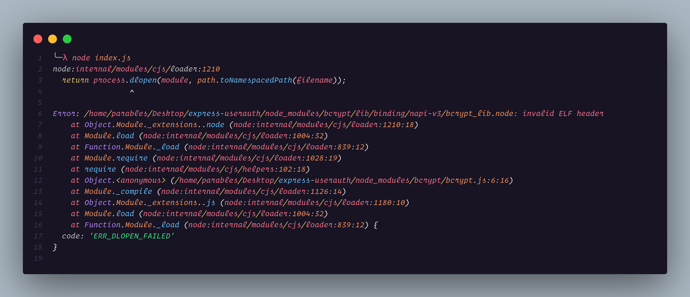
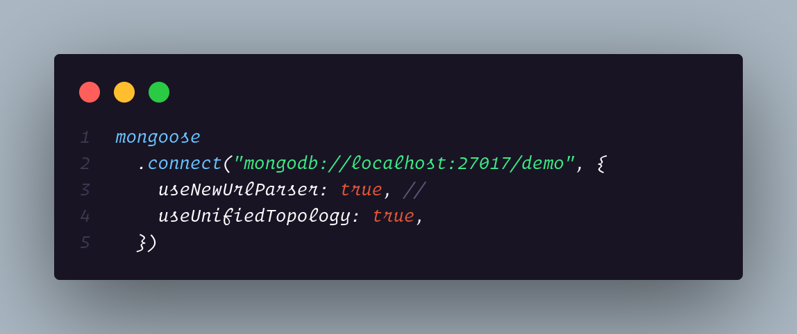

- Must Read
	- [Flutter Linting and Linter Comparison | RydMike Fluttering](https://rydmike.com/blog_flutter_linting)
	- [Greg Young's Blog](https://gregfyoung.wordpress.com/)
	-
- NOW It works on my machine??? Use Docker - YouTube video
  :LOGBOOK:
  CLOCK: [2022-10-13 Thu 01:45:33]
  :END:
	- A friend requested my help and so sent me an invitation on GitHub.
	- I cloned the repo.
	- Seeing a `package.json` file, I inferred that it was a node js project so I did `npm install`
	- The `package.json` file didn't contain any script commands so I run `node index.js`
	- Then I was hit with this nasty looking error:
	- 
	- Turns out the above error is an OS related issue. See this [StackOverflow solution](https://stackoverflow.com/questions/15809611/bcrypt-invalid-elf-header-when-running-node-app)
		- Basically, I had to uninstall `bcrypt` and install it again so that it will be compiled properly for Linux
	- The next issue I had was, he used a local instance of mongoDB installed on his machine, leaving me with 2 options: either I install mongoDB on my Linux, which is not something I would want to do for numerous reasons. The second option was to use a MongoDB Atlas, the cloud version for MongoDB, which would take some time to signup, create a cluster and set it up for the project.
	- 
-